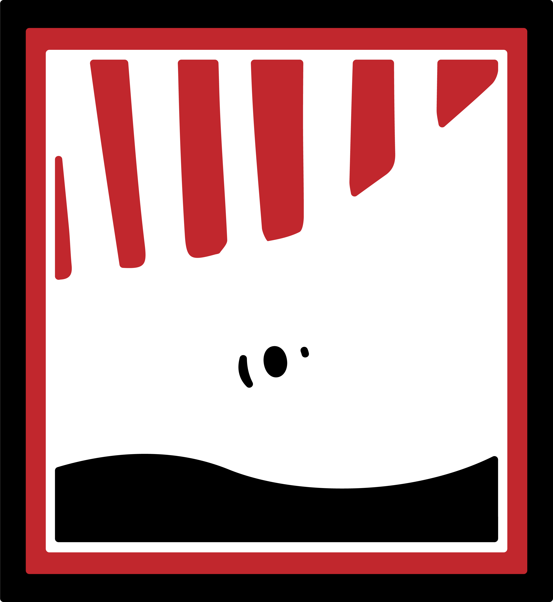

 
<h1> Maogmang Belly </h1>   

## Description

Maogmang Belly is a web-based proprietary website of a local-based restaurant of the same name. Created to assist the business owner, the website aims to provide an online platform for customers to order, reserve, and book a catering service. The website will also serve as a promotion, showcasing the menu or list of food the restaurant offers.  
 
 

## Usage

<ol>
 <li>Clone GitHub repo for this project locally  </li>
 <code>git clone git@github.com:StrayMarimo/MaogmangBelly.git</code>
 <li>Go to project  </li>
 <code>cd maogmangbelly</code>  
 <li>Install composer dependencies </li>
 <code>composer install </code>
 <li>Install NPM dependencies </li>  
 <code>npm install </code>
 <li> Create a copy of .env example file  </li>
 <code>cp .env.example .env </code>
 <li> Create MySQL database named maogmangbelly </li>
 <li>Change the credentials in the .env file </li>
 <li>Run npm:  </li>
 <code>npm run dev</code>  
 <li>Migrate db:  </li>
 <code>php artisan migrate</code> 
 <li>Run seeders:  </li>
 <code>php artisan db:seed</code>
 <li>Run server:  </li>
 <code>php artisan serve </code>
</ol>
 

## Core Developers:

<b>Project Lead: </b> Angeline B. Basbas   
 
<b>Frontend Team: </b>
    <li> Ian Peter L. Lastimosa</li>
    <li> Matthew Gerald H. Consulta </li>  
<b> Backend Team </b>
    <li> Jerome G. Flores </li>
    <li> Angeline B. Basbas </li> 

